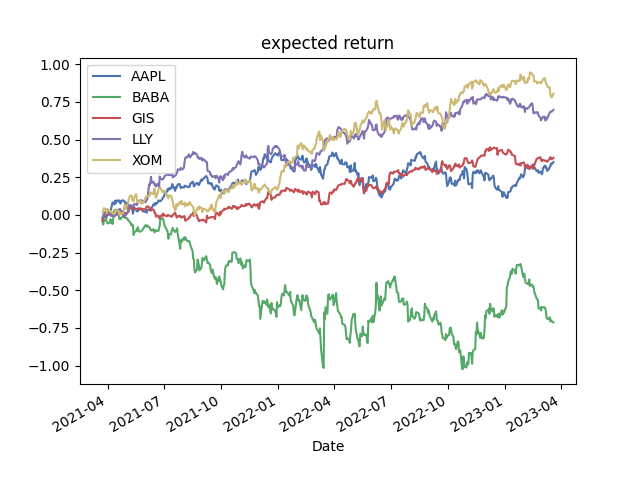

 
  

<h1 align="center"> Portfolio Optimizations and stock forecasting </h1>
<h3 align="center"> Becode project for time series analysis and discovery of the finance world </h3>

 
  

<h2 id="table-of-contents"> :book: Table of Contents</h2>

  
Table of Contents

  <ol>
    <li><a href="#Description"> ➤ Description</a></li>
    <li><a href="#Objectives"> ➤ Objectives</a></li>
    <ul>
        <li><a href="#Challenges"> Challenges</a></li>
        <li><a href="#Limitations">Limitations</a></li>
        <li><a href="#Further developments">Further developments</a></li>
      </ul>
    <li><a href="#folder-structure"> ➤ Folder Structure</a></li>
    <li><a href="#installation"> ➤ Installation</a></li>
    <li><a href="#usage"> ➤ Usage</a></li>
    <li><a href="#Results-and-discussion"> ➤ Results and Discussion</a></li>
    <li><a href="#Visuals"> ➤ Visuals</a></li>
    <!--<li><a href="#experiments">Experiments</a></li>-->
    <li><a href="#Timeline"> ➤ Timeline</a></li>
    <li><a href="#contributors"> ➤ Contributors</a></li>
  </ol>

<h2 id="Description"> :memo: Description</h2>
    
 
    This project is about portfolio Optimization using Time Series forecasting to try and predict future stock prices. The Optimization is done Using the efficient frontier optimization and the forecasting is using an Auto-Ml tool called pycaret and oscillate between some statistical models and other.  
    :no_entry_sign: disclaimer : this project is a learning project, the ambition is not to make money out of it and the solutions presented here will not help you if you seek this.
    

<h2 id="Objectives"> :dart: Objectives</h2>
    
  
     :radio_button: Familiarity with basic finance vocabulary  
     :radio_button: Understand time-series manipulations  
     :radio_button: Understand time-series forecasting  
     :radio_button: Experience an optimization problem  
    

    <h3 id="Strenghs"> Strenghts</h3>
        
 
         :radio_button: full pipeline from getting data to forecasting 
         :radio_button: Discovery of lots of tools (pyportfolioOpt, pycaret, quantstats ...) 
         :radio_button: Database Interaction possible 
        

    <h3 id="Limitations"> Limitations </h3>
        
 
        :radio_button: No Way for the user to interact with the project 
        :radio_button: Portfolio Optimisation Not complete enough 
        

    <h3 id="Further Developments"> Further developments</h3>
        
 
        :radio_button: Creation of an user interface (Deployement of an application)  
        :radio_button: Centralisations of the information of Optimization in one place 
        

<h2 id="folder-Structure"> :file_folder: Folder structure</h2>
    
 
    1. <b>/Assets</b>-folder contains the images for this Readme and some other plots from my research  
    2. <b>/notebooks</b>-folder contains all my reseach notebooks, these are not useful to run the solutions but if you want to see my learnings and tests feel free to go through them.  
    3. <b>/src</b>-folder contains all the Python files to run the complete solution, all you need is to run the <b>main.py</b> file to have the solutions The source code is in the other pythons files.  
    4. <b>requirement.txt</b>-contains all the dependencies you have to install to run the solution.  
    

<h2 id="installation"> :repeat: Installation</h2>
    
 
    clone the repo on your machine  
    Activate an virtual environment in <b>Python 3.10</b>  
    then install the different dependecies mentionned in the requirement.txt
    

<h2 id="Usage"> :interrobang: Usage</h2>
    
 
    1. Choose the portfolio you want to invest in (in the file there's already one for testing).  
    2. Run the <b>main.py</b> file to have first some Optimizations plots and then the forecasting plots.(it takes some time for the forecasting plots to show because it runs through Pycaret)  
    

<h2 id="Results-and-discussion"> :microscope: Results and discussions</h2>
    <h3 id="Optimization"> :ledger: Porfolio Optimization</h3>
            
 
            Not knowing anything about finance, it has been a hard journey trough the lingo and the different formulas and techniques. The different librairies that I've tested/used are a little outdated so it was quite hard to have satisfying and understandable results. 
            I finally used PyportfolioOpt module, it is great to have fast weights distribution but still quite hard to piece everything together. 
            So the results are showed in the <b>Visuals</b> part we can see the expected return of the actual portfolio, the covariance matrix and the expected weigths. I want to make it more clear for the user what all of this mean. 
            

    <h3 id="forecasting"> :chart_with_upwards_trend: Stocks forecasting</h3>
            
 
            Using the ,low-code Auto-ML ,module Pycaret was interesting. It took a lot of coding out of the project and helped me focus on the results and metrics of the different models. 
            Also it was for me the first experience with statistical models and I took some time studying them and they seem to really have some intersting usages for the future.. 
            The results are the forecasting from Pycaret, I can say that stocks are really hard to predict so this was a challenge. For some stocks i have results but for other not. The process is very long for forecasting several stocks and the results not very satisfying so I don't know if all of this is is really worth it.
            

    <h3 id="together"> :key: Putting it all together</h3>
            
 
            So ideally the goal of the projet was to make optimizations on stocks predictions. 
            for me this solution is not really viable, but I offer porfolio optimisation on stocks and then forecasting these same stocks. It's not really useful to optimize a predicted portfolio because the predictions are really not accurate. There's a lot of macro economical factors that we would have needed to take as account.  
            So this project was a great learning project, my future objectives for it would be to deploy an app with a clear user interface. 
            

<h2 id="Visuals"> :movie_camera: Visuals</h2>
    
 
    

     <h3> Portfolio Optimization plots </h3>
    
 
    Plots of the optimizations of a portfolio using PyportfoliOpt module. 
    

  
  
  
     

  <h3> Forecasting Plots </h3>
    
 
    These are some the results of the forecasting using Pycaret to select the best model for each stocks and predict the next month adjusted closed prices.
    

  
  
  

<h2 id="Timeline"> :calendar: Timeline</h2>
    
 
    from the 8/03/23 to the 21/03/23  
    10 days total
    

<h2 id="Contributors"> :raising_hand: Contributors</h2>
    
Héloïse feldmann <a href="https://github.com/Yheloww">  Github account</a>

        